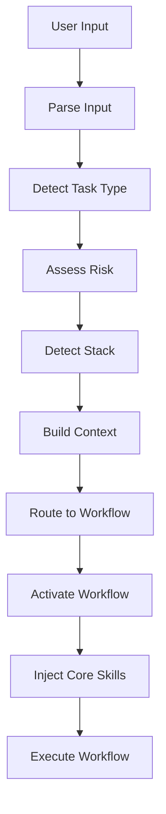

# Detection Algorithm — Full Pseudocode

The implementation lives in `session-orchestrator`. This file documents the algorithm in detail for reference.

---

## Step 1: Parse User Input

```typescript
function parseUserInput(input: string): ParsedInput {
  return {
    originalInput: input,
    keywords: extractKeywords(input),
    patterns: matchPatterns(input),
    entities: extractEntities(input),  // file paths, module names, etc.
  };
}
```

---

## Step 2: Detect Task Type

```typescript
function detectTaskType(parsed: ParsedInput): TaskType {
  // Check explicit commands first
  if (parsed.originalInput.startsWith('/consult')) return 'consult';
  if (parsed.originalInput.startsWith('/review')) return 'review';

  // Check keywords and patterns
  if (hasKeywords(parsed, ['implement', 'add', 'create', 'build'])) {
    return 'feature';
  }

  if (hasKeywords(parsed, ['fix', 'bug', 'error', 'broken'])) {
    return 'bug';
  }

  if (hasKeywords(parsed, ['refactor', 'restructure', 'improve'])) {
    return 'refactor';
  }

  if (hasKeywords(parsed, ['how', 'what', 'why', 'should'])) {
    return 'consult';
  }

  // Default: consult
  return 'consult';
}
```

---

## Step 3: Assess Risk

```typescript
interface RiskFactors {
  // Path-based risk
  pathContains: string[];           // ['auth', 'payment', 'migration']

  // Change scope
  fileCount: number;                 // 1 file = lower risk
  modifiesSchema: boolean;           // DB schema changes = high risk
  touchesCriticalPath: boolean;      // Critical features = high risk
  crossContextChanges: boolean;      // Multiple bounded contexts = higher risk

  // Security impact
  touchesAuth: boolean;              // Auth changes = critical
  touchesPayments: boolean;          // Payment changes = critical
  exposesNewEndpoint: boolean;       // New API = medium+ risk

  // Complexity
  linesOfCodeChange: number;         // More lines = potentially higher risk
  cyclomaticComplexity: number;      // Complex logic = higher risk
}

function calculateRisk(factors: RiskFactors): RiskLevel {
  // Critical risk indicators
  if (factors.touchesAuth || factors.touchesPayments || factors.modifiesSchema) {
    return 'critical';
  }

  // High risk indicators
  if (factors.crossContextChanges || factors.touchesCriticalPath) {
    return 'high';
  }

  // Medium risk indicators
  if (factors.exposesNewEndpoint || factors.fileCount > 3) {
    return 'medium';
  }

  // Default to low
  return 'low';
}

async function assessRisk(parsed: ParsedInput, taskType: TaskType): Promise<RiskLevel> {
  const factors: RiskFactors = {
    pathContains: detectCriticalPaths(parsed.entities),
    fileCount: await estimateFileCount(parsed),
    modifiesSchema: await detectSchemaModification(parsed),
    touchesCriticalPath: detectCriticalPath(parsed),
    crossContextChanges: await detectCrossContextChanges(parsed),
    touchesAuth: containsKeywords(parsed, ['auth', 'authentication', 'authorization']),
    touchesPayments: containsKeywords(parsed, ['payment', 'stripe', 'transaction']),
    exposesNewEndpoint: taskType === 'feature' && containsKeywords(parsed, ['endpoint', 'route', 'controller']),
  };

  return calculateRisk(factors);
}
```

---

## Step 4: Detect Stack

```typescript
interface StackIndicators {
  nestjs: {
    files: ['nest-cli.json', 'tsconfig.json'],
    imports: ['@nestjs/common', '@nestjs/core'],
    decorators: ['@Controller', '@Injectable', '@Module']
  },
  typeorm: {
    files: ['ormconfig.json', 'data-source.ts'],
    imports: ['typeorm'],
    decorators: ['@Entity', '@Column']
  },
  react: {
    files: ['package.json'],
    dependencies: ['react', 'next'],
    patterns: ['useState', 'useEffect']
  }
}

async function detectStack(): Promise<string[]> {
  const stack: string[] = [];

  if (await fileExists('nest-cli.json')) {
    stack.push('nestjs');
  }

  if (await fileExists('ormconfig.json') || await fileExists('data-source.ts')) {
    stack.push('typeorm');
  }

  const packageJson = await readPackageJson();
  if (packageJson.dependencies?.react) {
    stack.push('react');
  }
  if (packageJson.dependencies?.next) {
    stack.push('nextjs');
  }

  return stack;
}
```

---

## Step 5: Route to Workflow

```typescript
interface WorkflowRoute {
  taskType: TaskType;
  risk: RiskLevel;
  workflow: string;
}

const ROUTING_TABLE: WorkflowRoute[] = [
  // Feature workflows
  { taskType: 'feature', risk: 'low', workflow: 'feature-development-fast-track' },
  { taskType: 'feature', risk: 'medium', workflow: 'feature-development-standard' },
  { taskType: 'feature', risk: 'high', workflow: 'feature-development-full-pipeline' },
  { taskType: 'feature', risk: 'critical', workflow: 'feature-development-critical' },

  // Bug workflows
  { taskType: 'bug', risk: 'low', workflow: 'bug-fixing-simple' },
  { taskType: 'bug', risk: 'medium', workflow: 'bug-fixing-standard' },
  { taskType: 'bug', risk: 'high', workflow: 'bug-fixing-systematic' },
  { taskType: 'bug', risk: 'critical', workflow: 'bug-fixing-critical' },

  // Refactor workflows
  { taskType: 'refactor', risk: 'low', workflow: 'refactoring-simple' },
  { taskType: 'refactor', risk: 'medium', workflow: 'refactoring-standard' },
  { taskType: 'refactor', risk: 'high', workflow: 'refactoring-architectural' },
  { taskType: 'refactor', risk: 'critical', workflow: 'refactoring-critical' },

  // Other workflows (risk-agnostic)
  { taskType: 'consult', risk: '*', workflow: 'consultation-pipeline' },
  { taskType: 'review', risk: '*', workflow: 'code-review-pipeline' },
];

function routeToWorkflow(context: TaskContext): string {
  const route = ROUTING_TABLE.find(
    r => r.taskType === context.taskType &&
         (r.risk === context.risk || r.risk === '*')
  );

  if (!route) {
    throw new Error(`No workflow found for context: ${JSON.stringify(context)}`);
  }

  return route.workflow;
}
```

---

## Auto-Activation Flow


