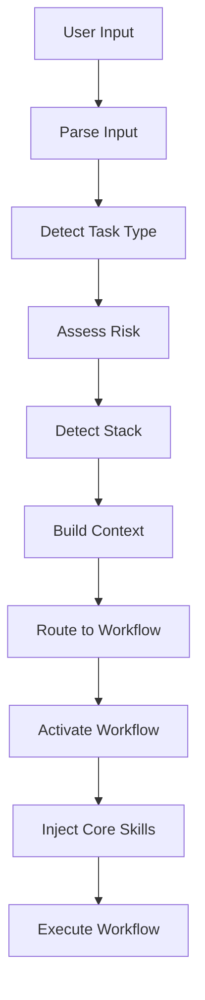

# Context Awareness - Reference Documentation

**Note**: This is reference documentation. The actual context detection logic is implemented in the `session-orchestrator` skill which is auto-loaded.

**Propósito**: Documenta los patrones de detección automática de tipo de tarea, riesgo, y stack.

---

## 🎯 Context Detection

### Task Type Detection

El sistema analiza el input del usuario para determinar el tipo de tarea:

| Task Type | Keywords | Patterns | Example |
|-----------|----------|----------|---------|
| **feature** | implement, add, create, build, new | `implement .+`, `add .+ to .+` | "Add authentication to API" |
| **bug** | bug, error, fix, broken, not working | `fix .+`, `.+ not working` | "Fix N+1 query in users endpoint" |
| **refactor** | refactor, restructure, improve, clean up | `refactor .+`, `improve .+` | "Refactor providers module to use Repository pattern" |
| **consult** | how, what, why, should I, mejor manera | `how (do\|can) I .+`, `should I use .+` | "Should I use Redis or in-memory cache?" |
| **review** | review, audit, check, revisar | `review .+`, `audit .+` | "Review the auth module code" |

---

### Risk Level Detection

El sistema evalúa el riesgo basado en múltiples factores:

```typescript
interface RiskFactors {
  // Path-based risk
  pathContains: string[];           // ['auth', 'payment', 'migration']

  // Change scope
  fileCount: number;                 // 1 file = lower risk
  modifiesSchema: boolean;           // DB schema changes = high risk
  touchesCriticalPath: boolean;      // Critical features = high risk
  crossContextChanges: boolean;      // Multiple bounded contexts = higher risk

  // Security impact
  touchesAuth: boolean;              // Auth changes = critical
  touchesPayments: boolean;          // Payment changes = critical
  exposesNewEndpoint: boolean;       // New API = medium+ risk

  // Complexity
  linesOfCodeChange: number;         // More lines = potentially higher risk
  cyclomaticComplexity: number;      // Complex logic = higher risk
}

function calculateRisk(factors: RiskFactors): RiskLevel {
  // Critical risk indicators
  if (factors.touchesAuth || factors.touchesPayments || factors.modifiesSchema) {
    return 'critical';
  }

  // High risk indicators
  if (factors.crossContextChanges || factors.touchesCriticalPath) {
    return 'high';
  }

  // Medium risk indicators
  if (factors.exposesNewEndpoint || factors.fileCount > 3) {
    return 'medium';
  }

  // Default to low
  return 'low';
}
```

---

### Stack Detection

El sistema detecta el stack del proyecto:

```typescript
interface StackIndicators {
  nestjs: {
    files: ['nest-cli.json', 'tsconfig.json'],
    imports: ['@nestjs/common', '@nestjs/core'],
    decorators: ['@Controller', '@Injectable', '@Module']
  },
  typeorm: {
    files: ['ormconfig.json', 'data-source.ts'],
    imports: ['typeorm'],
    decorators: ['@Entity', '@Column']
  },
  react: {
    files: ['package.json'],
    dependencies: ['react', 'next'],
    patterns: ['useState', 'useEffect']
  }
}
```

---

## 🔄 Workflow Routing

### Routing Matrix

```typescript
interface WorkflowRoute {
  taskType: TaskType;
  risk: RiskLevel;
  workflow: string;
}

const ROUTING_TABLE: WorkflowRoute[] = [
  // Feature workflows
  { taskType: 'feature', risk: 'low', workflow: 'feature-development-fast-track' },
  { taskType: 'feature', risk: 'medium', workflow: 'feature-development-standard' },
  { taskType: 'feature', risk: 'high', workflow: 'feature-development-full-pipeline' },
  { taskType: 'feature', risk: 'critical', workflow: 'feature-development-critical' },

  // Bug workflows
  { taskType: 'bug', risk: 'low', workflow: 'bug-fixing-simple' },
  { taskType: 'bug', risk: 'medium', workflow: 'bug-fixing-standard' },
  { taskType: 'bug', risk: 'high', workflow: 'bug-fixing-systematic' },
  { taskType: 'bug', risk: 'critical', workflow: 'bug-fixing-critical' },

  // Refactor workflows
  { taskType: 'refactor', risk: 'low', workflow: 'refactoring-simple' },
  { taskType: 'refactor', risk: 'medium', workflow: 'refactoring-standard' },
  { taskType: 'refactor', risk: 'high', workflow: 'refactoring-architectural' },
  { taskType: 'refactor', risk: 'critical', workflow: 'refactoring-critical' },

  // Other workflows (risk-agnostic)
  { taskType: 'consult', risk: '*', workflow: 'consultation-pipeline' },
  { taskType: 'review', risk: '*', workflow: 'code-review-pipeline' },
];
```

---

## 🧠 Context Analysis Examples

### Example 1: Feature Request

**User Input**: "Add JWT refresh token rotation to the auth system"

**Context Analysis**:
```typescript
{
  taskType: 'feature',          // "Add" keyword
  risk: 'critical',             // Touches auth + complex feature
  stack: ['nestjs', 'typeorm'],
  scope: 'multi-module',        // Auth + tokens + middleware
  touchesCriticalPath: true,
  touchesAuth: true,

  // Risk calculation
  riskFactors: {
    pathContains: ['auth'],     // ← Critical path
    touchesAuth: true,          // ← Critical indicator
    exposesNewEndpoint: true,   // /refresh endpoint
    crossContextChanges: false,
    modifiesSchema: false
  }
}
```

**Routed To**: `feature-development-critical`

**Pipeline Activated**:
1. Context Awareness (auto) ✅
2. Brainstorming (obligatorio)
3. Security Pre-Assessment
4. Writing Detailed Plans (con rollback plan)
5. **Manual Approval Gate** ⚠️
6. TDD Enforcement (muy estricto)
7. Executing Plans (step-by-step)
8. Two-Stage Review
9. Security Audit
10. Integration + E2E Tests
11. **Manual Final Approval** ⚠️
12. Verification
13. Finish

---

### Example 2: Bug Fix

**User Input**: "Fix the N+1 query problem in /api/users endpoint"

**Context Analysis**:
```typescript
{
  taskType: 'bug',              // "Fix" keyword
  risk: 'medium',               // Performance issue, not security
  stack: ['nestjs', 'typeorm'],
  scope: 'single-module',
  touchesCriticalPath: false,   // Users endpoint, not auth
  issueType: 'performance',

  riskFactors: {
    pathContains: ['users'],
    performanceImpact: true,
    touchesEntity: true,
    fileCount: 2                // service + test
  }
}
```

**Routed To**: `bug-fixing-standard`

**Pipeline Activated**:
1. Context Awareness (auto) ✅
2. Systematic Debugging - Phase 1: Reproduce
3. Systematic Debugging - Phase 2: Root Cause Analysis
4. Systematic Debugging - Phase 3: Hypothesis Testing
5. Writing Fix Plan
6. TDD (test → fix)
7. Verification + Regression Tests
8. Finish

---

### Example 3: Refactor

**User Input**: "Refactor the providers module to use Repository pattern"

**Context Analysis**:
```typescript
{
  taskType: 'refactor',         // "Refactor" keyword
  risk: 'medium',               // Module refactor, not architectural
  stack: ['nestjs', 'typeorm'],
  scope: 'module',
  touchesCriticalPath: false,
  refactorType: 'pattern-introduction',

  riskFactors: {
    fileCount: 5,               // Service, entity, tests, etc.
    modifiesEntity: false,      // No schema change
    introducesPattern: true,    // New pattern
    behaviorChange: false       // Should be same behavior
  }
}
```

**Routed To**: `refactoring-standard`

**Pipeline Activated**:
1. Context Awareness (auto) ✅
2. Architecture Patterns Review
3. Identify Code Smells
4. Writing Refactor Plan
5. Tests Pass Gate (before)
6. Incremental Refactoring
7. Tests Pass After Each Step
8. Code Review (NestJS patterns)
9. Coverage Verification
10. Finish

---

### Example 4: Consultation

**User Input**: "Should I use Redis or in-memory cache for session storage?"

**Context Analysis**:
```typescript
{
  taskType: 'consult',          // "Should I" pattern
  risk: 'n/a',                  // Consultation has no direct risk
  stack: ['nestjs'],
  questionType: 'architecture-decision',
  requiresExpertise: ['backend', 'devops'],

  consultationContext: {
    decision: 'caching-strategy',
    options: ['redis', 'in-memory'],
    impactArea: 'session-storage'
  }
}
```

**Routed To**: `consultation-pipeline`

**Pipeline Activated**:
1. Context Awareness (auto) ✅
2. Context Gathering (stack, scale, constraints)
3. Consult (select backend + devops experts)
4. [Optional] Transition to Implementation (if user decides)
5. Finish

---

### Example 5: Code Review

**User Input**: "Review the cutoffs module for OWASP vulnerabilities and NestJS best practices"

**Context Analysis**:
```typescript
{
  taskType: 'review',           // "Review" keyword
  risk: 'n/a',                  // Review doesn't change code
  stack: ['nestjs', 'typeorm'],
  scope: 'module',
  reviewType: 'security + quality',

  reviewFocus: {
    security: true,             // OWASP requested
    quality: true,              // Best practices requested
    performance: false,
    architecture: false
  }
}
```

**Routed To**: `code-review-pipeline`

**Pipeline Activated**:
1. Context Awareness (auto) ✅
2. Scope Detection (cutoffs module)
3. Two-Stage Review
   3.1 Spec Conformance (if spec available)
   3.2 Code Quality Review (NestJS patterns)
4. Security Audit (OWASP checklist)
5. Generate Report
6. [Optional] Auto-Fix Suggestions
7. Finish

---

## 📋 Context Detection Algorithm

### Step 1: Parse User Input

```typescript
function parseUserInput(input: string): ParsedInput {
  return {
    originalInput: input,
    keywords: extractKeywords(input),
    patterns: matchPatterns(input),
    entities: extractEntities(input),  // file paths, module names, etc.
  };
}
```

---

### Step 2: Detect Task Type

```typescript
function detectTaskType(parsed: ParsedInput): TaskType {
  // Check explicit commands first
  if (parsed.originalInput.startsWith('/consult')) return 'consult';
  if (parsed.originalInput.startsWith('/review')) return 'review';

  // Check keywords and patterns
  if (hasKeywords(parsed, ['implement', 'add', 'create', 'build'])) {
    return 'feature';
  }

  if (hasKeywords(parsed, ['fix', 'bug', 'error', 'broken'])) {
    return 'bug';
  }

  if (hasKeywords(parsed, ['refactor', 'restructure', 'improve'])) {
    return 'refactor';
  }

  if (hasKeywords(parsed, ['how', 'what', 'why', 'should'])) {
    return 'consult';
  }

  // Default: consult
  return 'consult';
}
```

---

### Step 3: Assess Risk

```typescript
async function assessRisk(parsed: ParsedInput, taskType: TaskType): Promise<RiskLevel> {
  const factors: RiskFactors = {
    pathContains: detectCriticalPaths(parsed.entities),
    fileCount: await estimateFileCount(parsed),
    modifiesSchema: await detectSchemaModification(parsed),
    touchesCriticalPath: detectCriticalPath(parsed),
    crossContextChanges: await detectCrossContextChanges(parsed),
    touchesAuth: containsKeywords(parsed, ['auth', 'authentication', 'authorization']),
    touchesPayments: containsKeywords(parsed, ['payment', 'stripe', 'transaction']),
    exposesNewEndpoint: taskType === 'feature' && containsKeywords(parsed, ['endpoint', 'route', 'controller']),
  };

  return calculateRisk(factors);
}
```

---

### Step 4: Detect Stack

```typescript
async function detectStack(): Promise<string[]> {
  const stack: string[] = [];

  // Check for NestJS
  if (await fileExists('nest-cli.json')) {
    stack.push('nestjs');
  }

  // Check for TypeORM
  if (await fileExists('ormconfig.json') || await fileExists('data-source.ts')) {
    stack.push('typeorm');
  }

  // Check for React/Next
  const packageJson = await readPackageJson();
  if (packageJson.dependencies?.react) {
    stack.push('react');
  }
  if (packageJson.dependencies?.next) {
    stack.push('nextjs');
  }

  return stack;
}
```

---

### Step 5: Route to Workflow

```typescript
function routeToWorkflow(context: TaskContext): string {
  const route = ROUTING_TABLE.find(
    r => r.taskType === context.taskType &&
         (r.risk === context.risk || r.risk === '*')
  );

  if (!route) {
    throw new Error(`No workflow found for context: ${JSON.stringify(context)}`);
  }

  return route.workflow;
}
```

---

## 🎯 Auto-Activation Flow



---

## 📊 Context Logging

Every context detection is logged for observability:

```json
{
  "timestamp": "2026-02-06T10:30:00Z",
  "userInput": "Add JWT refresh token rotation",
  "context": {
    "taskType": "feature",
    "risk": "critical",
    "stack": ["nestjs", "typeorm"],
    "scope": "multi-module",
    "riskFactors": {
      "touchesAuth": true,
      "pathContains": ["auth"]
    }
  },
  "workflowRouted": "feature-development-critical",
  "estimatedDuration": "2-4 hours"
}
```

---

## ✅ Validation Rules

### Rule 1: Always Detect Context

**NEVER proceed without context detection.**

```diff
- ❌ User: "Add validation"
     Agent: [Starts coding immediately]

+ ✅ User: "Add validation"
     Agent: [Detects context]
     Context: feature, low risk, nestjs
     Workflow: feature-development-fast-track
     [Proceeds with appropriate pipeline]
```

---

### Rule 2: Explicit Risk Confirmation for Critical

**ALWAYS confirm with user for critical risk tasks.**

```typescript
if (context.risk === 'critical') {
  await askUserConfirmation(
    `This task touches ${context.riskFactors.criticalAreas.join(', ')}. ` +
    `I'll use the critical pipeline with manual approval gates. Proceed?`
  );
}
```

---

### Rule 3: Allow User Override

**User can override detected context if needed.**

```bash
User: "Add field to User entity --risk=low"
# Manual override: treat as low risk even if entity modification usually = medium
```

---

## 🔧 Configuration

### orchestrator.config.json

```json
{
  "contextDetection": {
    "enabled": true,
    "customKeywords": {
      "feature": ["agregar", "implementar"],  // Spanish keywords
      "bug": ["corregir", "arreglar"]
    }
  },

  "riskDetection": {
    "criticalPaths": [
      "src/auth/**",
      "src/payment/**",
      "database/migrations/**"
    ]
  },

  "autoActivation": {
    "requireConfirmation": {
      "critical": true,
      "high": false,
      "medium": false,
      "low": false
    }
  }
}
```

---

## 📚 Summary

**Context Awareness ensures**:

1. ✅ Every task is properly classified (feature/bug/refactor/consult/review)
2. ✅ Risk is accurately assessed (low/medium/high/critical)
3. ✅ Appropriate workflow is activated automatically
4. ✅ No manual workflow selection needed (unless override desired)
5. ✅ Quality gates match the actual risk of the change

**The Result**: Right workflow, every time, automatically.

---

**Auto-injected in**: ALL sessions, beginning of every task
**Can be disabled**: NO (critical skill)
**Override allowed**: YES (user can specify risk/workflow manually)
