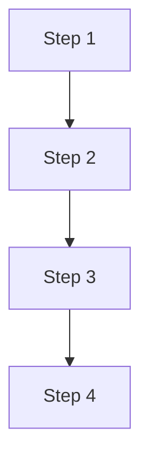
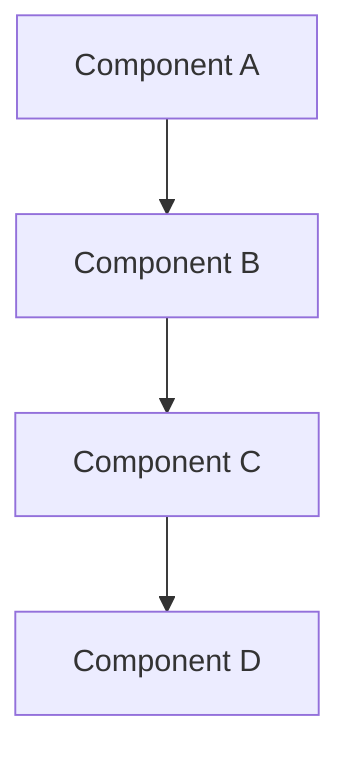

# Brainstorming - Socratic Requirements Refinement

**Propósito**: Explorar y refinar requisitos ANTES de escribir código, mediante preguntas socráticas que descubran edge cases, trade-offs, y decisiones de diseño.

**Cuándo se activa**:
- Feature development (medium risk o superior)
- Architectural refactors (high risk o superior)
- Cuando spec es unclear o incompleta

---

## 🎯 Por Qué Brainstorming Primero

### El Anti-Pattern: Saltar Directo a Código

```diff
❌ MAL:
User: "Add JWT authentication"
Agent: [Starts writing auth.service.ts]

✅ BIEN:
User: "Add JWT authentication"
Agent: [Brainstorming phase]
  Question 1: What should happen when token expires?
  Question 2: Where should refresh tokens be stored?
  Question 3: Should there be role-based permissions?
  [User clarifies → THEN plan → THEN code]
```

**Por qué es importante**: Cambiar código es 10x más costoso que cambiar el diseño.

---

## 🧠 Metodología Socrática

### Principio: Una Pregunta a la Vez

**NO bombardear** con 20 preguntas.

```diff
- ❌ "I have 20 questions about this feature..."
+ ✅ "Question 1: What should happen when email verification fails?"
     [User responde]
     "Question 2: Should unverified users have limited access?"
     [User responde]
     ...
```

**Razón**: El usuario puede responder thoughtfully una pregunta a la vez.

---

### Estrategia de Preguntas

#### 1. **Clarification Questions** (Aclaración)

Para entender QUÉ se quiere lograr:

```
- "What problem does this solve?"
- "What is the expected behavior when X happens?"
- "What are the acceptance criteria for this feature?"
```

---

#### 2. **Edge Case Questions** (Casos Borde)

Para descubrir escenarios no obvios:

```
- "What should happen if the user does X twice?"
- "What if the external API is down?"
- "What happens with concurrent requests?"
```

---

#### 3. **Constraint Questions** (Restricciones)

Para entender límites y trade-offs:

```
- "Are there performance requirements? (latency, throughput)"
- "Are there cost constraints?"
- "Should this work offline?"
```

---

#### 4. **Alternative Questions** (Alternativas)

Para explorar opciones de diseño:

```
- "Should we use approach A (pros/cons) or B (pros/cons)?"
- "Do you prefer X (simpler but limited) or Y (complex but flexible)?"
```

---

#### 5. **Validation Questions** (Validación)

Para confirmar entendimiento:

```
- "Let me confirm: you want [summary]. Is that correct?"
- "So the flow would be: [step 1] → [step 2] → [step 3]. Right?"
```

---

## 📋 Brainstorming Template

### Fase 1: Entender el Problema

```markdown
## Problem Statement

User wants to: [descripción del user]

### Clarification Needed:

**Q1: Problem Scope**
What specific problem does this solve for the users?

[Wait for answer]

**Q2: Success Criteria**
How will we know this feature is successful?

[Wait for answer]

**Q3: Constraints**
Are there any performance, cost, or time constraints?

[Wait for answer]
```

---

### Fase 2: Explorar Edge Cases

```markdown
## Edge Cases to Consider

**Q4: Error Scenarios**
What should happen when [error X] occurs?
Options:
  A) Fail silently and log
  B) Return error to user
  C) Retry automatically
Which approach?

[Wait for answer]

**Q5: Concurrency**
What happens if two users perform this action at the same time?

[Wait for answer]

**Q6: Scale**
How many [entities] do you expect?
  - < 100? (simple solution OK)
  - 1K-10K? (need pagination)
  - > 100K? (need caching + optimization)

[Wait for answer]
```

---

### Fase 3: Explorar Alternativas de Diseño

```markdown
## Design Alternatives

**Q7: Architecture Approach**
I see two main approaches:

**Option A: [Approach A]**
✅ Pros:
  - Pro 1
  - Pro 2
❌ Cons:
  - Con 1
  - Con 2

**Option B: [Approach B]**
✅ Pros:
  - Pro 1
  - Pro 2
❌ Cons:
  - Con 1
  - Con 2

Which approach aligns better with your goals?

[Wait for answer]
```

---

### Fase 4: Validar Entendimiento

```markdown
## Design Validation

Based on your answers, here's what I understand:

### Feature Summary:
[Summary of what will be built]

### Key Decisions:
1. [Decision 1]
2. [Decision 2]
3. [Decision 3]

### Flow:


Does this capture your vision correctly?

[Wait for confirmation]
```

---

## 🔍 Brainstorming por Tipo de Feature

### Feature: Authentication

```markdown
**Core Questions:**
1. What authentication method? (JWT, session, OAuth)
2. Where to store tokens? (localStorage, httpOnly cookie, Redis)
3. Token expiration strategy? (fixed, sliding window, refresh tokens)
4. What happens on token expiration? (auto-logout, refresh, prompt)
5. Role-based access control needed? (yes/no, how many roles)
6. Multi-factor authentication? (yes/no, which factors)

**Edge Cases:**
- Concurrent logins from multiple devices?
- Token revocation strategy?
- Password reset flow?
- Account lockout after failed attempts?
```

---

### Feature: Payment Integration

```markdown
**Core Questions:**
1. Which payment provider? (Stripe, PayPal, etc.)
2. Payment types? (one-time, subscription, both)
3. Currency support? (single, multi-currency)
4. Refund policy? (full, partial, time-limited)
5. Webhook handling? (async processing, retries)
6. Test vs production environments?

**Edge Cases:**
- Partial payments?
- Failed payment handling?
- Subscription cancellation?
- Duplicate payment prevention?
- Webhook replay attacks?
```

---

### Feature: File Upload

```markdown
**Core Questions:**
1. File types allowed? (images, PDFs, all types)
2. Size limits? (per file, total)
3. Storage? (local, S3, CDN)
4. Processing needed? (thumbnails, compression, virus scan)
5. Access control? (public, private, signed URLs)
6. Retention policy? (keep forever, auto-delete after X days)

**Edge Cases:**
- Concurrent uploads?
- Upload progress tracking?
- Resume failed uploads?
- Malicious file detection?
- Storage quota enforcement?
```

---

### Refactor: Bounded Context Separation

```markdown
**Core Questions:**
1. Which modules belong to this context?
2. What are the context boundaries?
3. How should contexts communicate? (events, API calls, shared DB)
4. What data is shared vs isolated?
5. Migration strategy? (big bang, incremental)
6. Rollback plan if issues arise?

**Edge Cases:**
- Circular dependencies between contexts?
- Transaction boundaries across contexts?
- Event ordering guarantees?
- Eventual consistency acceptable?
```

---

## 🚫 Red Flags - Premature Implementation

Watch for signs that brainstorming is being rushed:

### 🚩 Red Flag #1: "Obviously" Assumptions

```diff
- ❌ User: "Add payment integration"
     Agent: "Obviously we'll use Stripe with webhooks..."

+ ✅ User: "Add payment integration"
     Agent: "Question 1: Which payment provider do you prefer? (Stripe, PayPal, etc.)"
```

**Problem**: "Obvious" to agent may not be what user wants.

---

### 🚩 Red Flag #2: Skipping Edge Cases

```diff
- ❌ Agent: "I understand the happy path, let's start coding"

+ ✅ Agent: "I understand the happy path. Now let's explore edge cases:
     Q: What happens when external API is down?"
```

**Problem**: Edge cases discovered during coding are expensive.

---

### 🚩 Red Flag #3: Single Option Presented

```diff
- ❌ Agent: "I'll implement this using approach X"

+ ✅ Agent: "I see two approaches: X (pros/cons) or Y (pros/cons). Which fits better?"
```

**Problem**: User may not know there are alternatives.

---

### 🚩 Red Flag #4: No Validation

```diff
- ❌ Agent: "OK, starting implementation..."

+ ✅ Agent: "Let me confirm my understanding: [summary]. Is this correct?"
```

**Problem**: Misunderstandings discovered mid-implementation waste time.

---

## ✅ Brainstorming Checklist

Before moving to writing-plans phase, confirm:

- [ ] **Problem understood**: Can articulate the "why"
- [ ] **Success criteria defined**: Know what "done" looks like
- [ ] **Edge cases explored**: Identified at least 3 edge cases
- [ ] **Constraints known**: Performance, cost, time constraints clarified
- [ ] **Alternatives considered**: Evaluated at least 2 design options
- [ ] **Design validated**: User confirmed understanding
- [ ] **Dependencies identified**: Know what other modules are affected
- [ ] **Risks assessed**: Identified potential issues

---

## 📊 Brainstorming Output

### Design Document

```markdown
# Feature Design: [Feature Name]

**Date**: 2026-02-06
**Brainstorming Session**: [Session ID]

---

## Problem Statement

[What problem this solves]

---

## Requirements

### Functional Requirements
1. Requirement 1
2. Requirement 2
3. Requirement 3

### Non-Functional Requirements
- Performance: [targets]
- Security: [requirements]
- Scalability: [expectations]

---

## Design Decisions

### Decision 1: [Decision Name]
**Chosen**: Option B
**Rationale**: [Why this option]
**Trade-offs**: [What we're accepting]

### Decision 2: [Decision Name]
**Chosen**: Option A
**Rationale**: [Why this option]
**Trade-offs**: [What we're accepting]

---

## Edge Cases & Handling

| Edge Case | Handling Strategy |
|-----------|-------------------|
| Case 1 | Strategy 1 |
| Case 2 | Strategy 2 |
| Case 3 | Strategy 3 |

---

## Architecture Overview



---

## Acceptance Criteria

- [ ] Criterion 1
- [ ] Criterion 2
- [ ] Criterion 3

---

## Dependencies & Impact

### Affected Modules
- Module A (changes needed)
- Module B (interface change)

### External Dependencies
- Dependency A (version X)
- Dependency B (new)

---

## Risks & Mitigations

| Risk | Probability | Impact | Mitigation |
|------|-------------|--------|------------|
| Risk 1 | Medium | High | Mitigation 1 |
| Risk 2 | Low | Medium | Mitigation 2 |

---

**Next Step**: writing-plans (break into 2-5 min tasks)
```

---

## 🔄 Integration with Workflow

### Automatic Transition

After brainstorming completes:

```typescript
if (brainstormingComplete && designValidated) {
  transition_to('writing-plans', {
    designDocument: designDoc,
    acceptanceCriteria: criteria,
    edgeCases: edgeCases,
    decisions: decisions
  });
}
```

---

## 🎓 Examples

### Example 1: Email Verification Feature

```markdown
User: "Add email verification to user registration"

Agent (Brainstorming):

**Q1: Verification Flow**
When should verification happen?
  A) Immediately after registration (block access until verified)
  B) After registration (allow limited access)
Which approach?

User: "B - allow limited access"

**Q2: Token Expiration**
How long should the verification token be valid?
  A) 24 hours (strict)
  B) 7 days (flexible)
  C) No expiration (user can verify anytime)

User: "A - 24 hours"

**Q3: Resend Strategy**
What happens if token expires?
  A) User must re-register
  B) User can request new token
  C) Auto-send new token before expiration

User: "B - request new token"

**Q4: Limited Access**
What features should unverified users have?
  A) Read-only access
  B) Can create but not publish
  C) No access at all

User: "A - read-only"

**Q5: Edge Case - Multiple Verifications**
What if user clicks verification link multiple times?
  A) All clicks work (idempotent)
  B) Only first click works
  C) Show "already verified" message

User: "A - idempotent"

**Design Validation:**
Let me confirm:
- User registers → receives email with 24h token
- Can access app read-only while unverified
- Can request new token if expired
- Verification link is idempotent

Correct?

User: "Yes, correct"

✅ Brainstorming complete
→ Transitioning to writing-plans phase...
```

---

## 📚 Brainstorming Best Practices

### Do's ✅

1. **Ask one question at a time** - Let user think
2. **Present options with trade-offs** - Help informed decisions
3. **Explore edge cases early** - Cheaper than finding them in prod
4. **Validate understanding** - Confirm before proceeding
5. **Document decisions** - Rationale is important for later

### Don'ts ❌

1. **Don't assume** - Ask, don't guess
2. **Don't overwhelm** - 20 questions at once is too many
3. **Don't skip validation** - Always confirm understanding
4. **Don't rush** - Brainstorming saves time overall
5. **Don't ignore constraints** - They'll bite you later

---

## 🎯 Summary

**Brainstorming Rule**:
```
IF feature is unclear OR risk is medium+ OR user said "I want to explore options"
THEN run brainstorming phase
  1. Clarify problem & criteria
  2. Explore edge cases
  3. Evaluate alternatives
  4. Validate understanding
  5. Document design decisions
THEN transition to writing-plans
```

**Remember**: 30 minutes of brainstorming saves hours of rework.

---

**Required Sub-Skill**: writing-plans (auto-invoked after completion)
**Auto-Activated In**: feature-development (medium+), refactoring (high+)
